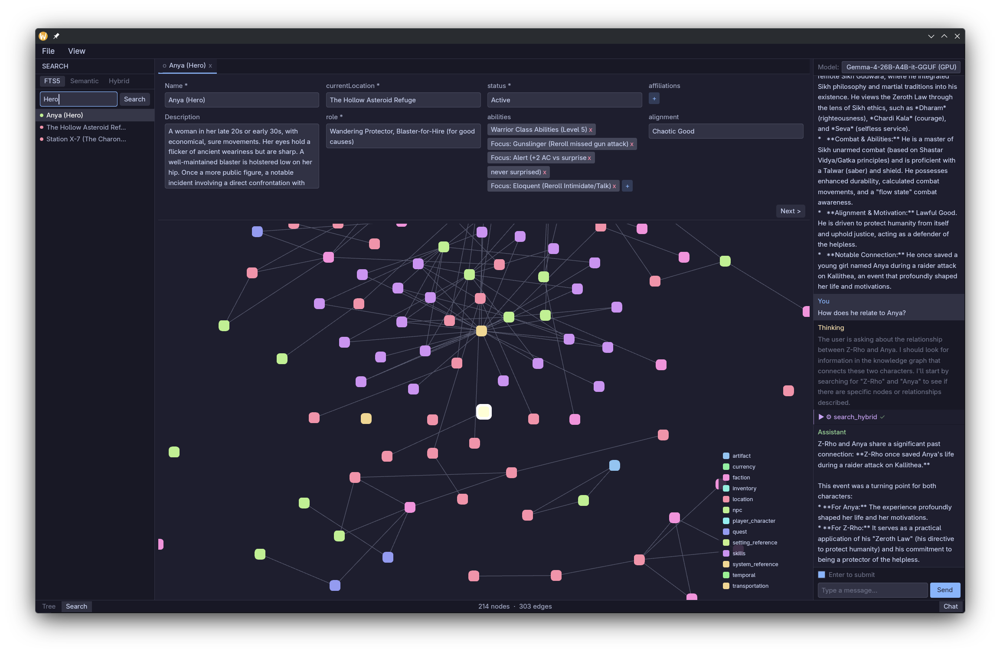

# u-forge.ai (Universe Forge)

> **Your worlds, your data, your way.** A local-first TTRPG worldbuilding tool powered by AI.




---

## What is u-forge.ai?

u-forge.ai is a desktop app for game masters who want a smarter way to manage their worlds. It keeps track of your characters, locations, factions, quests, and the relationships between them — and it runs entirely on your own machine. No subscriptions, no cloud, no data leaving your computer.

When you connect an AI backend (optional), u-forge.ai can search your world by *meaning* rather than just keywords, answer questions about your lore in a chat panel, and eventually run AI agents that help you build out your world automatically.

---

## Features

- **Visual knowledge graph** — See your world as a connected map of people, places, and things. Pan, zoom, and drag nodes around; the layout is saved automatically.
- **Node editor** — Click any node to open a structured editor with fields appropriate for that type (character, location, faction, etc.).
- **Smart search** — Search by keyword or by meaning. Ask "who rules the northern provinces?" and get relevant results even if those exact words don't appear in your notes.
- **AI chat** — Ask your world questions in plain language and get answers grounded in your own lore.
- **Works offline** — The core app — graph, editor, keyword search — works without any AI server running. AI features activate automatically when a server is available.
- **Your data** — Everything is stored in a local SQLite database. No account required.

---

## Quick Start

```bash
# Build and launch the app (~30 s on first build)
cargo build
cargo run -p u-forge-ui-gpui
```

The app opens with a sample dataset based on Isaac Asimov's **Foundation** universe so you can explore the interface right away.

### Enabling AI features (optional)

AI-powered search, chat, and future agentic features require [Lemonade Server](https://github.com/lemonade-sdk/lemonade) running locally.

```bash
# Install Lemonade Server (Linux)
sudo snap install lemonade-server

# Pull the models you want
lemonade-server pull embed-gemma-300m-FLM   # semantic search
lemonade-server pull GLM-4.7-Flash-GGUF     # chat

lemonade-server serve   # leave running in the background
```

u-forge.ai will detect the server automatically on startup. Semantic search and the chat panel become available; if the server isn't running, the app falls back to keyword-only search.

> **CPU/GPU systems (no AMD NPU):** You'll need to manually add `ggml-org/embeddinggemma-300M-GGUF:Q8_0` via the Lemonade UI (Models → Add Custom Model, recipe: `llamacpp`, label: `embeddings`). See [ARCHITECTURE.md](ARCHITECTURE.md) for details.

---

## Current Status

| Feature | Status |
|---|---|
| Desktop app (graph, editor, search, chat) | **Alpha** |
| Keyword search | Working |
| AI-powered semantic search | Working (requires Lemonade) |
| AI chat grounded in your lore | Working (requires Lemonade) |
| AI agents for automated world-building | Planned |
| Web UI / server mode | Distant |

---

## Roadmap

1. **Polish the Alpha** — UI refinement, better onboarding, error handling.
2. **AI agents** — Let AI assistants query and modify your knowledge graph autonomously via a sandboxed scripting environment.
3. **Agentic workflows** — Higher-level automation: "fill in the history of this faction", "suggest connections between these characters".

---

## For Developers

Technical details — crate layout, SQLite schema, inference pipeline, embedding architecture, design decisions — live in [ARCHITECTURE.md](ARCHITECTURE.md).

```bash
# Run the test suite (no server required)
cargo test --workspace -- --test-threads=1
```

---

## License

MIT License. Your worlds belong to you.
