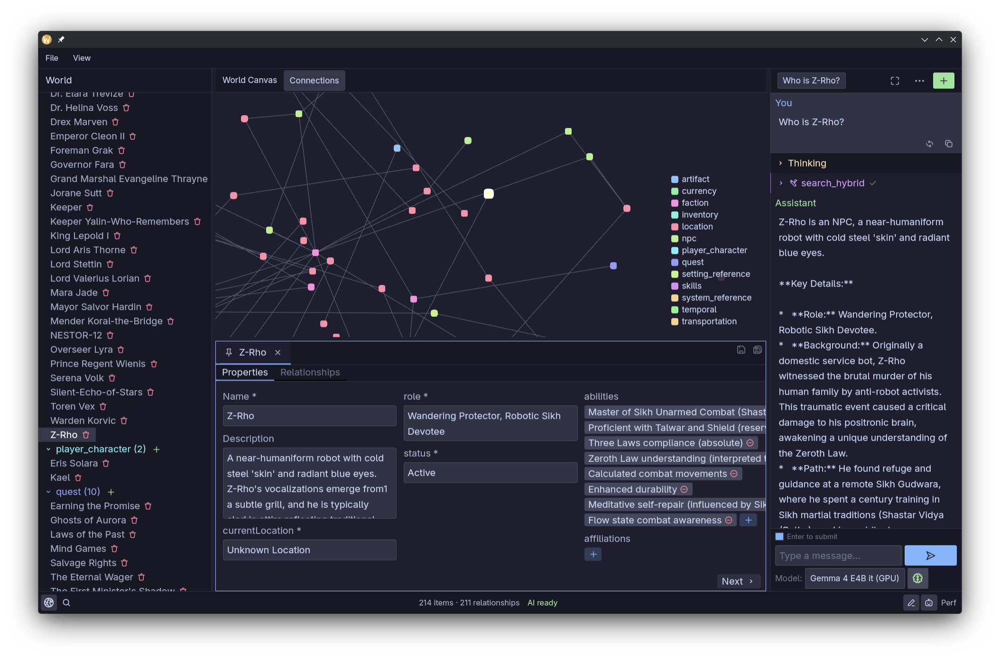

# u-forge.ai (Universe Forge)

> **Build a world you can see, search, and talk to.** A local-first creative
> workspace for game masters.




## Your setting is more than a stack of notes

Characters serve factions. Artifacts change hands. Quests cross continents,
and events from centuries ago still shape the next session. u-forge turns all
of that lore into a living knowledge graph: one place to create your world,
follow its relationships, retrieve what matters, and collaborate with a local
AI assistant that understands the structure you designed.

- **See the whole setting.** World Canvas turns people, places, factions,
  quests, events, and anything else you define into an explorable relationship
  map.
- **Make the world model yours.** Schemas define the kinds of things in your
  setting, the details they carry, and the relationships they allow. The editor
  adapts to your campaign instead of forcing every world into the same sheet.
- **Find lore the way you remember it.** Exact-word, semantic, and hybrid
  search bring the right pieces back even when you cannot remember where you
  wrote them.
- **Ask questions in context.** The Assistant answers from your own setting,
  shows when it searches the graph, and keeps conversations beside the world
  they are about.
- **Create with the Assistant.** Compatible local models can search, create,
  and update world items and relationships while respecting your schemas.
- **Keep imperfect data visible.** Imports are validated against your world
  model, with malformed records and ambiguous relationships reported instead
  of silently changing its shape.

## Your worlds belong to you

u-forge is local-first. Worlds live in local SQLite databases and require no
account, subscription, or hosted service. Graph exploration, editing,
import/export, and word search keep working without an AI server.

Optional AI runs through
[Lemonade Server](https://github.com/lemonade-sdk/lemonade). On Linux x86_64,
u-forge can provision and manage a private Lemonade runtime; it can also use a
separately managed server. World data leaves your machine only when you
explicitly connect u-forge to a non-local endpoint.

World, Search, Details, Assistant, and the permanent World Canvas stay together
in a focused native workspace. The included Foundation setting offers a quick
way to explore, or you can start with your own schemas and JSONL data.

## The road to 1.0

The roadmap expands the same foundation rather than replacing it: structured
world data becomes more expressive, easier to navigate, and increasingly useful
at the table.

| Release | Focus |
|---------|-------|
| **v0.1.2** | Another refinement cycle for the core worldbuilding experience. |
| **v0.2** | Schema-embedded SVG icons replace colored squircles in the World panel and graph view. Any node can override its schema icon with its own embedded SVG. |
| **v0.3** | Embedding and chunking refactor for more intelligent semantic encoding and efficient retrieval. |
| **v0.4** | Timeline view with temporal nodes in a dedicated top or bottom strip and three lanes—epochs, eras, and events—for nuanced histories, narrative arcs, and systemic impact. |
| **v0.5** | World map view that uses `located_in` relationships to place connected entities automatically and turn existing world data into a richer map. |
| **v0.6** | Session diarization and transcription, preserving play sessions so they can be recalled and converted into world data with the Assistant. |
| **v0.7–v0.8** | Rules from PDF: apply the retrieval refactor to table-heavy TTRPG rulebooks, build a dedicated rules knowledge graph, and link sourced rules directly to your world. |
| **v0.9** | Refinement release. |
| **v1.0** | Feature complete. Your worlds await! |
| **v1.x** | Scheming intensifies… |

Release contents and ordering may evolve as each feature meets real worlds and
real tables.

## Try v0.1.1

Linux x86_64 releases are distributed as an AppImage with a companion SHA-256
checksum. Download both files from the release, then verify and run them:

```bash
sha256sum --check u-forge-0.1.1-x86_64.AppImage.sha256
chmod +x u-forge-0.1.1-x86_64.AppImage
./u-forge-0.1.1-x86_64.AppImage
```

The AppImage bundles u-forge, its default schemas and example data, and its
private Lemonade runtime. See [COMPAT.md](COMPAT.md) for the current platform
and hardware guidance. Developers and source-build users should start with
[BUILD.md](BUILD.md).

On first launch, u-forge creates its per-user files at the standard XDG paths:

- configuration: `${XDG_CONFIG_HOME:-$HOME/.config}/u-forge/u-forge.toml`
- worlds and editable defaults: `${XDG_DATA_HOME:-$HOME/.local/share}/u-forge`
- Lemonade models and runtime state: `${XDG_CACHE_HOME:-$HOME/.cache}/u-forge/lemonade`

The shipped defaults are copied only once, so edits and deletions in your user
copy remain yours across later launches.

### Start a world

A new profile opens a guided world-creation flow. Choose a schema directory
and, optionally, an initial JSONL data file. Lemonade discovery and downloads
continue in the background, so a schema-only world can be created without
waiting for AI models.

Use **File → Import Schema…** and **File → Import Data…** for later imports.
Select an item in World or on the canvas, edit it in Details, and save the
change when it is ready.

## Project documentation

- [Compatibility and hardware](COMPAT.md)
- [Build, test, and release](BUILD.md)
- [Architecture](ARCHITECTURE.md)
- [Product and implementation ledger](.plans/README.md)

## License

MIT License. Your worlds belong to you.
